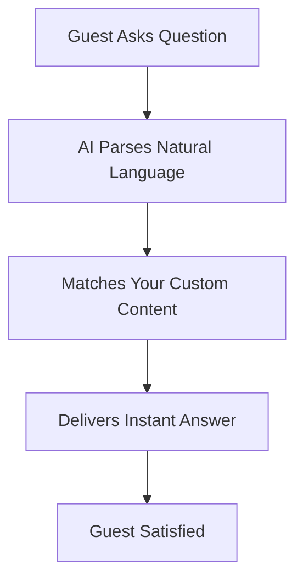

## Overview

Alfie Host is your digital guest manual that delivers instant answers to guests' questions about their stay. You create a customizable guide once, and guests chat naturally—like asking "What's the Wi-Fi password?" or "Where's the best coffee nearby?"—to get responses without interrupting you. This minimizes guest-host disruptions and boosts your 5-star reviews effortlessly.

<Columns cols={3}>
  <Card title="Instant Answers" icon="zap" href="/docs/features">
    Guests get responses in seconds via natural language chat.
  </Card>
  <Card title="Customizable" icon="edit-3" href="/docs/customize">
    Tailor content for your property, from check-in to local tips.
  </Card>
  <Card title="Review Booster" icon="star" href="/docs/reviews">
    Happy guests leave better feedback with self-service info.
  </Card>
</Columns>

## Key Benefits

Experience the advantages tailored to your role.

<Tabs>
  <Tab title="For Hosts" icon="home">
    Reduce interruptions by 80% as guests self-serve answers 24/7. Focus on hospitality, not repetitive queries. Track interactions to refine your setup and earn more positive reviews.

    <Callout kind="success">
      Hosts report a 30% increase in 5-star ratings after setup.
    </Callout>
  </Tab>
  <Tab title="For Guests" icon="users">
    Chat naturally for quick info on amenities, check-in, house rules, or local spots. Enjoy a seamless stay without waiting for replies.

    <Callout kind="tip">
      Share your Alfie Host link via booking confirmation for instant access.
    </Callout>
  </Tab>
</Tabs>

## How It Works

Alfie Host processes guest queries through a simple flow.



You set up once:

<Steps>
  <Step title="Create Account" icon="user-plus">
    Sign up at app.alfiehost.com and verify your property details.
  </Step>
  <Step title="Build Guide" icon="edit">
    Add sections like Wi-Fi (`network: AlfieGuest`, password: `welcome123`), check-in instructions, and FAQs.
  </Step>
  <Step title="Share Link" icon="share-2">
    Embed in your booking site or send via email. Guests chat immediately.
  </Step>
</Steps>

## Support and Resources

Get help whenever you need it.

<ExpandableGroup>
  <Expandable title="Quick Setup Guide" default-open="true">
    1. Log in to your dashboard.
    2. Navigate to `Properties` > `New Guide`.
    3. Upload photos and text for sections like `Amenities` and `Local Recommendations`.

    ```javascript
    // Example API integration for advanced users
    const alfieResponse = await fetch('https://api.alfiehost.com/v1/query', {
      method: 'POST',
      headers: { 'Authorization': 'Bearer YOUR_API_KEY', 'Content-Type': 'application/json' },
      body: JSON.stringify({ query: 'Wi-Fi password?', propertyId: 'prop_123' })
    });
    ```
  </Expandable>
  <Expandable title="Community & Support">
    Join our Discord for tips: discord.gg/alfiehost. Email support@alfiehost.com for personalized help. Check <a href="/docs/troubleshooting">Troubleshooting</a> for common issues.
  </Expandable>
</ExpandableGroup>

<Columns cols={2}>
  <Card title="Documentation" icon="book-open" href="/docs">
    Full guides and API reference.
  </Card>
  <Card title="Contact Us" icon="mail" href="mailto:support@alfiehost.com">
    Reach our team directly.
  </Card>
</Columns>